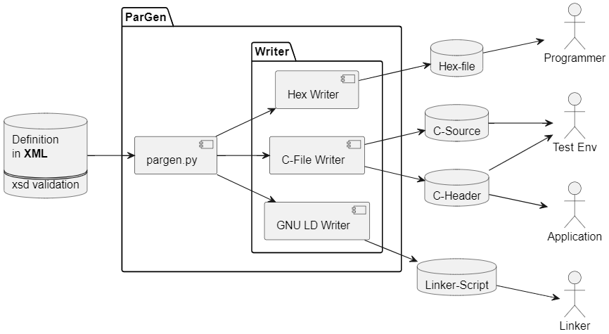

# ParGen - A tool for Flashable Parameter Container Creation

ParGen is an embedded development tool for generation of parameters values that
can be stored in flash memory and maintained independent from the application.
It allows to alter/update parameter values without recompilations.

## Concept and Planned Features

* Read input from a schema validated XML file
* Generate C-Source stubs for embedding into the application source amd testing environments
* Generate Intel Hex files for flashing with a programmer
* Generate GNU linker include file for mapping the parameter to absolute addresses
* Generate A2L fragments for accessing the parameters from AUTOSAR test environments

## Installing Python Dependencies

An example configuration is in the 'example' folder. To run it make sure to have
all dependencies from requirements.txt installed. Run the following inside the
checked out sandbox folder:

### MacOS/Linux

    python3 -m venv .venv
    python3 -m pip install -r requirements.txt
    source .venv/bin/activate

### Windows

    python -m venv .venv
    python -m pip install -r requirements.txt
    .venv\Scripts\activate.bat (or Activate.ps1 for powershell)

## Build a Installation Package

An installable wheel file can be created using the build package and the following commands:
    
    python3 -m pip install --upgrade build
    python3 -m build

The wheel file will be generated in the dist folder:

    ls dist
    flashcontainer-0.0.1-py3-none-any.whl   flashcontainer-0.0.1.tar.gz

## Create a Development Editable Install

An editable install is needed for running the unittests and development of the package itself.
It installs the package in the local virtual environment, but uses the python files form the
src folder.

    python3 -m pip install -e .

The parameter generator tool can then by called on cmdline using 

    $ pargen -h
    usage: pargen [-h] [--version] [--ihex IHEX] [--csrc CSRC] [--gld GLD] file

    A tool for generating flashable parameter container.

    positional arguments:
        file         XML parameter definition file

    options:
        -h, --help   show this help message and exit
        --version    show program's version number and exit
        --ihex IHEX  Generate intelhex file with given name.
        --csrc CSRC  Generate c/c++ header and source file using given basename.
         --gld GLD    Generate GNU linker include file for parameter symbol generation.    

## Running the Example

Go to the folder example and run the "run.bat" or "run.sh" script. It should create
the following output:

    pargen 0.0.1 : A tool for generating flashable parameter container.
    copyright (c) 2022 haju.schulz@online.de

    Generating intelhex file example.hex
    Generating C-files param.[ch]
    Generating GNU Linker script example.ld
    Done.

The tools parses the example.xml parameter definition file and converts it into
* Intel hex files for flashing
* C/H files for accessing the parameter in applications (H-File) and unittests (C-File)
* GNU Linker script for generating parameter symbols at the flash adresses

# Issues, Ideas And Bugs

If you have further ideas or you found some bugs, great! Create an [issue](https://github.com/issues) or if you are able and willing to fix it by yourself, clone the repository and create a pull request.

## License

The whole source code is published under the [BSD 3-Clause License](https://opensource.org/licenses/BSD-3-Clause/).
Consider also the different licenses of used third party libraries too!

## Contribution

We welcome contribution, but unless you explicitly state otherwise: Any contribution intentionally submitted for inclusion in the work by you, shall be licensed as above, without anyadditional terms or conditions.
